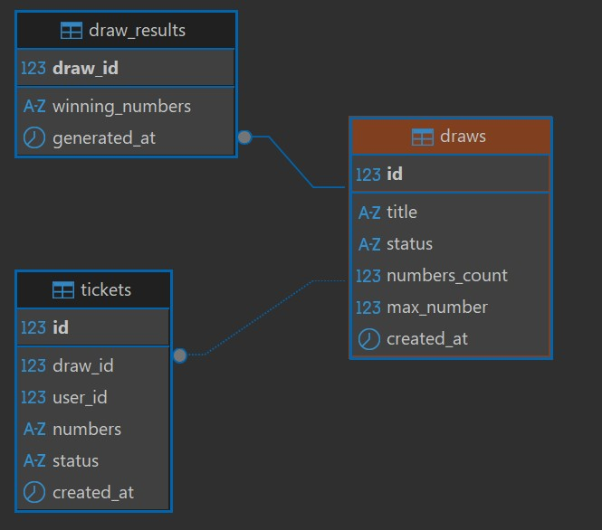
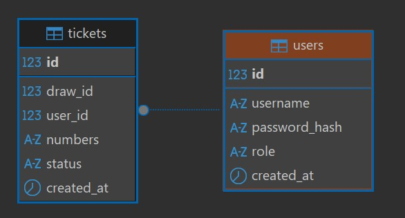

# LotterySystemTeam26 - Документация проекта #
___

## Объём реализации ## 

Сценарий 1. Базовая лотерея

В системе должны быть реализованы:

- создание тиража;
- получение списка активных тиражей;
- создание билета;
- генерация выигрышной комбинации;
- проверка результата билета;
- отображение статусов билетов WIN или LOSE.

---

## 1. Инструкции по развёртыванию приложения ##

## 1.1 Развёртывание и запуск на локальном сервере (ПК)

### Требования:

#### На сервере (ПК) должны быть установлены:
````
- Java 17 (JDK) или выше.
- Maven 3.9.9
- БД PostgreSQL версии 18.3 или выше.
````

#### По умолчанию программа будет пытаться установить соединение с БД используя настройки:
````
- DB_URL=jdbc:postgresql://hackathon_postgres:5432/lottery_db
- DB_USER=postgres
- DB_PASSWORD=postgres
````

#### Для задания собственных настроек подключения к БД **НЕОБХОДИМО СОЗДАТЬ ПЕРЕМЕННЫЕ ОКРУЖЕНИЯ**:
```
- DB_URL=jdbc:postgresql://[HOST]:[PORT]/[DB_NAME]
- DB_USER=[USERNAME]
- DB_PASSWORD=[PASSWORD]
```

### Сборка приложения:

Для сборки приложения нужно открыть директорию с проектом в терминале и выполнить команду:
```shell
    mvn clean package
```

После успешного выполнения этой команды в папке проекта появится новая папка target,
внутри которой будет лежать файл 
```LotterySystemTeam26-1.0.jar.``` 
Это и есть наше готовое приложение.

### Для запуска приложения нужно:
- открыть терминал, перейти в директорию с файлом ```LotterySystemTeam26-1.0.jar```
- выполнить команду
```shell
    java -jar LotterySystemTeam26-1.0.jar
```


## 1.2 Развертывание и запуск в Docker

### Требования:

#### На сервере (ПК) должны быть установлены:
````
- Docker
- Docker-compose
````

### Скрипт запуска БД PostgreSQL(папка infra) и что делает:

#### Скрипт Windows запуска БД PostgreSQL в контейнере:
````shell 
    run-db.bat 
````
#### Cкрипт Linux запуска БД PostgreSQL в контейнере
```shell
    run-db.sh
```

- Запускать в директории infra
- Удаляет старые образ и контейнер
- Спрашивает желаемый пароль для БД в контейнере
- Стягивает базовый образ с PostgreSQL
- Собирает новый образ
- Запускает контейнер с нужными параметрами
- При остановке или удалении контейнера **данные сохраняются** (созданные таблицы и данные в них)

### Как запустить контейнер с Java:
````shell
    docker build -t hackathon_java -f .\infra\java-dockerfile .
    docker run --name hackathon_java -p 8080:8080 -e DB_URL=jdbc:postgresql://hackathon_postgres:5432/lottery_db -e DB_USER_NAME=postgres -e DB_USER_PASSWORD=postgres --network hackathon_network -d hackathon_java
````


### Как запустить приложение целиком:
- #### В первый раз:
```shell
    docker compose -f infra/docker-compose.yaml up -d --build
```
 
- #### Последующие разы без пересборки:
```shell
    docker compose -f infra/docker-compose.yaml up -d
```


---

## 2. Инструкция по работе приложения


@@@@@@@@@@@@@@@@@@@@@@@@@@@@@


---

## 3. АРХИТЕКТУРА РЕШЕНИЯ

### 3.1 Слои приложения

```
┌─────────────────────────────────────┐
│  API Layer (Javalin)                │
│  - HTTP Routes                      │
│  - Authorization & Roles            │
│  - Request/Response DTOs            │
└─────────────────────────────────────┘
              ↓
┌─────────────────────────────────────┐
│  Service Layer                      │
│  - AuthService (auth & sessions)    │
│  - DrawService (draw lifecycle)     │
│  - TicketService (ticket management)│
│  - GeneratorUtil (number generation)│
│  - [Draw/Ticker/User]Validator      │
│          (validations)              │
└─────────────────────────────────────┘
              ↓
┌─────────────────────────────────────┐
│  Repository Layer (JDBC)            │
│  - UserRepository                   │
│  - DrawRepository                   │
│  - DrawResultRepository             │
│  - TicketRepository                 │
└─────────────────────────────────────┘
              ↓
┌─────────────────────────────────────┐
│  Database Layer (PostgreSQL)        │
│  - users,                           │
│  - draws,                           │
│  - tickets,                         │
│  - draw_results,                    │
│  - migrations (Flyway)              │
└─────────────────────────────────────┘
```


### 3.2 Технологический стек

- **Язык**: Java 17 (JDK)
- **Build**: Maven 3.9.9, Maven-wrapper-3.3.4
- **REST API**: Javalin 7.2.0 (без Spring)
- **БД**: PostgreSQL 18.3
- **Пул соединений**: HikariCP
- **Миграции**: Flyway
- **ORM Framework**: Hibernate
- **Вспомогательные Frameworks**: Jakarta, Lombok
- **Логирование**: SLF4J + Logback
- **Тестирование**: JUnit 5
- **Контейнеризация**: Docker + Docker Compose


### 3.3 Структура проекта

```
src/main/java/team26/
├── Application.java                     # Entry point
├── api/
│   └── ApiRoutes.java                   # REST routes, auth middleware
├── service/
│   ├── AuthService.java                 # Auth & session management
│   ├── DrawService.java                 # Draw lifecycle
│   ├── TicketService.java               # Ticket operations
│   └── LotteryEngine.java               # Number generation & validation
├── repository/
│   ├── JdbcUserRepository.java          # User CRUD
│   ├── JdbcDrawRepository.java          # Draw CRUD & settlement
│   └── JdbcTicketRepository.java        # Ticket CRUD
├── domain/
│   ├── lotteryDraw/
│   │   ├── LotteryDraw.java             # Draw entity (Hibernate)
│   │   ├── LotteryDrawRecord.java       # Draw entity (record)
│   │   └── LotteryDrawStatus.java       # Enum: SCHEDULED, ACTIVE, COMPLETED, CANCELLED  
│   ├── lotteryDrawResult/   
│   │   ├── LotteryDrawResults.java      # Draw result entity (Hibernate)
│   │   └── LotteryDrawResultsRecord.java  # Draw result entity (record) 
│   ├── lotteryTicket/       
│   │   ├── LotteryTicket.java           # Ticket entity (Hibernate)
│   │   ├── LotteryTicketRecord.java     # Ticket entity (record)
│   │   └── LotteryTicketStatus.java     # Enum: PENDING, WIN, LOSE
│   └── user/
│       ├── User.java                    
│       ├── UserRecord.java              # User entity (record)
│       └── UserRole.java                # Enum: ADMIN, USER              
├── config/
│   ├── api/
│   │   └── JavalinConfig.java           # API(Javalin) config
│   └── database/
│       ├── AppConfig.java               # Environment config
│       └── Database.java                # Connection pool & migration runner
├── exceptions/
│   ├── ApiException.java                # Unified error handling                    
│   ├── ErrorResponse.java               # Error Response entity (record)
│   └── UnauthorizedException.java       # Unauthorized error handling
└── util/
    ├── database/
    │   └── Helper.java                  # Lottery ticket`s numbers validation
    ├── PasswordHasher.java              # SHA-256 hashing
    └── NumberCodec.java                 # Encode/decode number lists

src/main/resources/
├── db/migration/
    └── V1__init_schema.sql              # Flyway migration (schema)

src/test/java/org/example/
└── AppTest.java                         # Unit tests for LotteryEngine

Docker/Infra:
├── Dockerfile                           # Multi-stage build
├── docker-compose.yml                   # App + PostgreSQL
├── .env_example                         # Environment template
├── db_dump_lottery_schema.sql           # Schema dump
└── README.md                            # Setup & API docs
```

---

## 4. МОДЕЛЬ ДАННЫХ





### 4.1 Таблица `users`

```sql
CREATE TABLE IF NOT EXISTS users (
    id BIGSERIAL PRIMARY KEY,
    username VARCHAR(64) NOT NULL UNIQUE,
    password_hash VARCHAR(128) NOT NULL,
    role VARCHAR(16) NOT NULL,                           -- ADMIN | USER
    created_at TIMESTAMPTZ NOT NULL DEFAULT now()
);
```

**Роли**:
- `ADMIN`: создаёт тиражи, проводит розыгрыши
- `USER`: покупает билеты, проверяет результаты

### 4.2 Таблица `draws`

```sql
CREATE TABLE IF NOT EXISTS draws (
    id BIGSERIAL PRIMARY KEY,
    title VARCHAR(128) NOT NULL,
    status VARCHAR(16) NOT NULL,                    -- ACTIVE | COMPLETED
    numbers_count INT NOT NULL,
    max_number INT NOT NULL,
    created_at TIMESTAMPTZ NOT NULL DEFAULT now()
);
```

**Статусы**:
- `ACTIVE`: идёт приём билетов
- `COMPLETED`: приём билетов завершён, результаты определены


### 4.3 Таблица `draw_results`

```sql
CREATE TABLE IF NOT EXISTS draw_results (
    draw_id BIGINT PRIMARY KEY REFERENCES draws(id),
    winning_numbers VARCHAR(128) NOT NULL,
    generated_at TIMESTAMPTZ NOT NULL DEFAULT now()
);
```

### 4.4 Таблица `tickets`

```sql
CREATE TABLE IF NOT EXISTS tickets (
    id BIGSERIAL PRIMARY KEY,
    draw_id BIGINT NOT NULL REFERENCES draws(id),
    user_id BIGINT NOT NULL REFERENCES users(id),
    numbers VARCHAR(128) NOT NULL,
    status VARCHAR(16) NOT NULL,                    -- PENDING | WIN | LOSE
    created_at TIMESTAMPTZ NOT NULL DEFAULT now()
);
```

**Статусы**:
- `PENDING`: ждёт завершения тиража
- `WIN`: билет выиграл
- `LOSE`: билет проиграл

### 4.5 Индексы

```sql
CREATE INDEX IF NOT EXISTS idx_draws_status ON draws(status);
CREATE INDEX IF NOT EXISTS idx_tickets_draw_id ON tickets(draw_id);
CREATE INDEX IF NOT EXISTS idx_tickets_user_id ON tickets(user_id);
```

---

## 5. REST API

ЗДЕСЬ БУДЕТ ОПИСАНИЕ REST API

---

## 6. БИЗНЕС-ЛОГИКА И СТАТУСЫ

### 6.1 Жизненный цикл тиража

```
                 ┌─────────────────────┐
                 │   СОЗДАНИЕ ТИРАЖА   │
                 │   (ADMIN создаёт)   │
                 └──────────┬──────────┘
                            ↓
                 ┌─────────────────────┐
                 │  Статус: ACTIVE     │
                 │  Принимаем билеты   │
                 └──────────┬──────────┘
                            ↓
              ┌─────────────────────────────┐
              │   ADMIN нажимает COMPLETE   │
              │  (POST /draws/{id}/complete)│
              └─────────────┬───────────────┘
                            ↓
        ┌─────────────────────────────────────────┐
        │   1. Генерируем выигрышные числа        │
        │   2. Создаём DrawResult                 │
        │   3. Обновляем статус Draw → COMPLETED  │
        │   4. Обновляем статусы Tickets:         │
        │      - совпадают с winning → WIN        │
        │      - остальные → LOSE                 │
        └───────────────────┬─────────────────────┘
                            ↓
                 ┌─────────────────────┐
                 │  Статус: COMPLETED  │
                 │  Результаты готовы  │
                 └─────────────────────┘
```

### 6.2 Жизненный цикл билета

```
              ┌──────────────────┐
              │  СОЗДАНИЕ БИЛЕТА │
              │  (USER покупает) │
              └────────┬─────────┘
                       ↓
        ┌─────────────────────────────┐
        │       Статус: PENDING       │
        │    Ждём завершения тиража   │
        └──────────────┬──────────────┘
                       ↓
  ┌─────────────────────────────────────────┐
  │     После COMPLETE тиража происходит    │
  │         сравнение чисел билета с        │
  │             winning_numbers             │
  └────────────────────┬────────────────────┘
                       ↓
       ┌────────────────────────────────┐
       │ Если совпадают/не совпадают:   │
       │       Статус: WIN/LOSE         │
       └────────────────────────────────┘
    
```

### 6.3 Правила валидации

**Draw создание**:
- `title` не пусто
- `numbersCount` ∈ [3, 10]
- `maxNumber` ∈ [10, 99]
- `numbersCount < maxNumber`

**Ticket создание**:
- Draw статус = ACTIVE
- Количество чисел = numbersCount тиража
- Все числа уникальны
- Все числа ∈ [1, maxNumber]

**Авторизация**:
- Все эндпоинты кроме `/auth/*` и `/health` требуют Bearer токен
- `/api/draws` требует ADMIN
- `/api/tickets` требует USER
- USER может видеть только свои билеты (кроме ADMIN)

---


