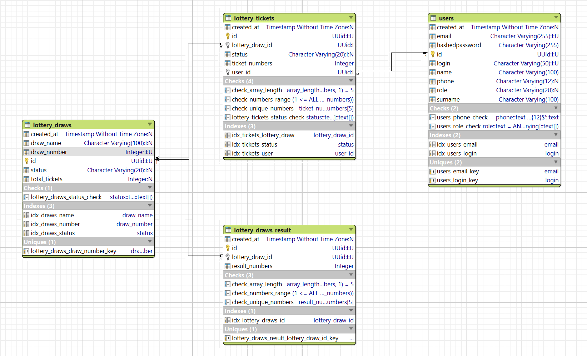

Database Config:
 1) Запуск миграции 2 способа:
    - mvn flyway:migrate "-Dflyway.url=jdbc:postgresql://localhost:7432/testDB" "-Dflyway.user=postgres" "-Dflyway.password=postgres"-->
    - запустить main.

Схема базы данных:

# Таблицы

## Таблица users:

1) id - Первичный ключ с типом UUID, генерируется автоматически.
2) name - Имя пользователя, строка, не равна null.
3) surname - Фамилия пользователя, строка, не равна null.
4) login - строка, не равен null, уникальный.
5) email - строка, не равен null, уникальный.
6) phone - строка, прринимает 12 чисел от 0 до 9.
7) role - строка, может иметь два значения USER или ADMIN, по умолчанию USER.
8) hashedPassword - строка, не равна null.
9) created_at - timestamp, значение задается при создании.

#### Индексы:

    - idx_users_email - ускоряет поиск по email
    - idx_users_login - ускоряет поиск по login

## Таблица lottery_draws:

1) id - Первичный ключ с типом UUID, генерируется автоматически.
2) draw_number - Целое число, не равно null, уникальный, генерируется автоматически как идентификатор (автоинкремент).
3) draw_name - Строка, может быть null (по умолчанию null).
4) total_tickets - Целое число - колличество купленых билетов на тираж, по умолчанию 0.
5) status - Строка, может иметь четыре значения: 'SCHEDULED', 'ACTIVE', 'COMPLETED' или 'CANCELLED', по умолчанию 'SCHEDULED'.
6) created_at - Timestamp, значение задается при создании (по умолчанию текущая дата и время).

#### Индексы:

    - idx_draws_status - для ускорения поиска по статусу розыгрыша
    - idx_draws_name - для ускорения поиска по названию розыгрыша
    - idx_draws_number - для ускорения поиска по номеру розыгрыша

## Таблица lottery_tickets:
1) id - Первичный ключ с типом UUID, генерируется автоматически.
2) user_id - UUID, не равен null, внешний ключ на таблицу users.
3) lottery_draw_id - UUID, не равен null, внешний ключ на таблицу lottery_draws.
4) status - Строка, может иметь три значения: 'PENDING', 'WIN' или 'LOSE', по умолчанию 'PENDING'.
5) ticket_numbers - Массив из 5 целых чисел, все числа в массиве уникальные, не равен null.
6) created_at - Timestamp, значение задается при создании (по умолчанию текущая дата и время).

#### Ограничения (Constraints):

    - fk_user_id - внешний ключ на users(id), при удалении пользователя билеты удаляются каскадно.
    - fk_lottery_draw_id - внешний ключ на lottery_draws(id), при удалении розыгрыша билеты удаляются каскадно.
    - check_array_length - массив ticket_numbers должен содержать ровно 5 элементов.
    - check_numbers_range - каждое число в массиве должно быть в диапазоне от 1 до 45 включительно.
    - check_unique_numbers - все 5 чисел в билете должны быть уникальными (не повторяться).

#### Индексы:

    - idx_draws_status - для ускорения поиска по статусу розыгрыша
    - idx_draws_name - для ускорения поиска по названию розыгрыша
    - idx_draws_number - для ускорения поиска по номеру розыгрыша

## Таблица lottery_draws_result:

1) id - Первичный ключ с типом UUID, генерируется автоматически.
2) result_numbers - Массив из 5 уникальных целых чисел, не равен null, генерируется функцией при создании generate_lottery_numbers().
3) created_at - Timestamp, значение задается при создании (по умолчанию текущая дата и время).
4) lottery_draw_id - UUID, не равен null, уникальный, внешний ключ на таблицу lottery_draws.

#### Ограничения (Constraints):

    - fk_lottery_draws_id - внешний ключ на lottery_draws(id), при удалении розыгрыша операция запрещена (RESTRICT).
    - check_array_length - массив result_numbers должен содержать ровно 5 элементов.
    - check_numbers_range - каждое число в массиве должно быть в диапазоне от 1 до 45 включительно.
    - check_unique_numbers - все 5 чисел должны быть уникальными (не повторяться).

#### Индексы:

    - idx_lottery_draws_id - для ускорения поиска результатов по идентификатору розыгрыша.

# Функции:

## generate_lottery_numbers():

Назначение: Генерирует случайный набор из 5 уникальных чисел для лотерейного розыгрыша.

#### Логика работы:

    - Генерирует случайные числа в диапазоне от 1 до 45.
    - Добавляет число в массив только если его еще нет в массиве.
    - Повторяет процесс до тех пор, пока не будет получено 5 уникальных чисел.
    - Возвращает массив целых чисел (INTEGER[5])